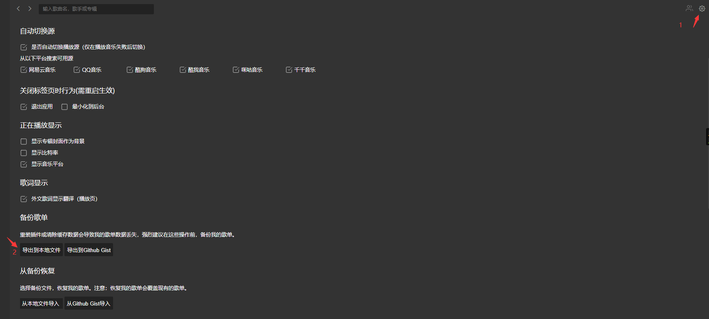
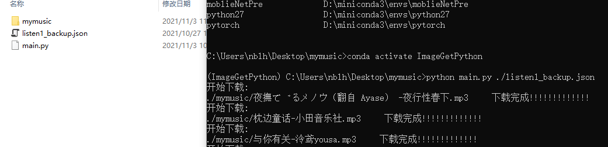

# 适用于LISTEN1 网易音乐的下载
# user for Listen1 Download wangyi music 
# 说明该脚本作为学习使用 
## 依赖
1. requests
```shell
conda install -n 虚拟环境名称 requests
```


## 使用方法
1. 在listen1 的系统设置中导出歌单  
     
2. 运行main.py文件  
   